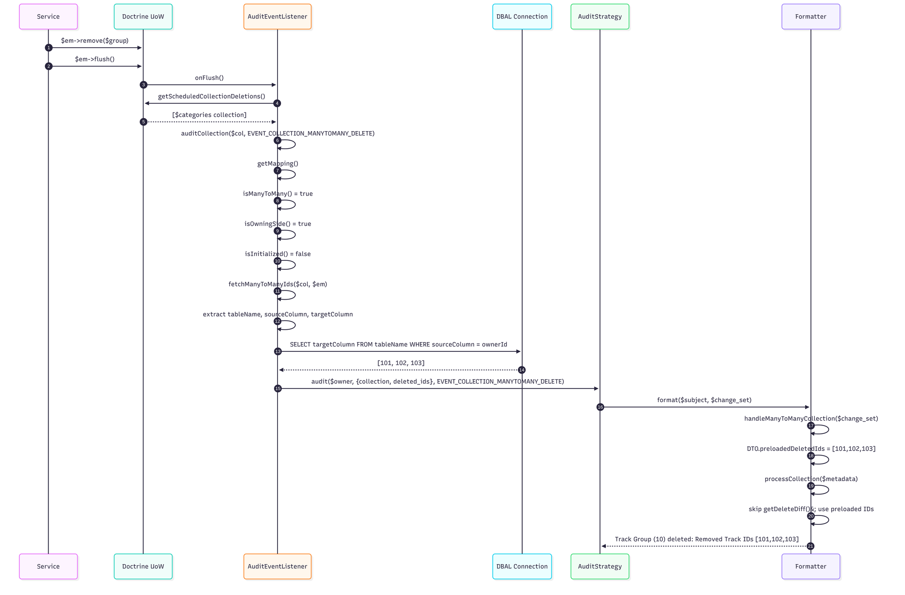
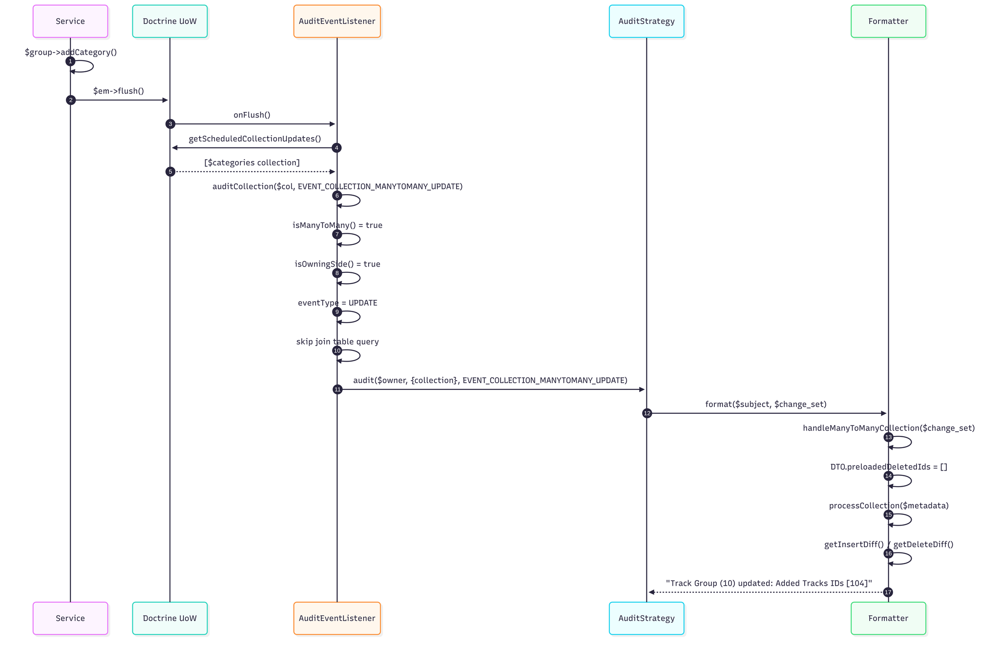

# ADR-004: M2M Audit Logging via Lightweight Join Table Query

**Date:** 2026-03-05
**Updated:** 2026-09-24 — Presentation and SummitEvent formatters added; file references aligned with the merged code
**Author:** Sebastian Marcet (sebastian@tipit.net)
**Status:** Accepted
**Context:** PR #498 — Audit logging for many-to-many relationship changes; subsequent refactoring via `PersistentCollectionMetadata` DTO. Extended to `Presentation` and `SummitEvent` after a customer reported a sponsor change missing from the event audit log (ClickUp 86bc6p5y1).

## Context

The audit logging system covers Doctrine ManyToMany collection changes (e.g., `PresentationCategoryGroup::$categories`, `SummitAttendee::$tags`). It works correctly for **updates** (add/remove while the owning entity lives), but has a gap on **deletions of the owning entity**.

When Doctrine's `getScheduledCollectionDeletions()` fires for a collection that is never loaded into memory (the owning entity is being deleted without its M2M relations ever accessed), `PersistentCollection::getDeleteDiff()` returns `[]` because no snapshot exists. The deleted IDs are silently lost from the audit trail.

### Rejected Alternative

Refactoring M2M relationships into intermediate entities (making the join table a first-class Doctrine entity) is rejected — it requires schema changes, migration of every M2M relationship, and changes to all service code that manages these collections. The cost vastly exceeds the benefit.

### Constraint

Commit `728ae6791` (Dec 2025) demonstrates that calling `count()`, `getSnapshot()`, or accessing collection elements during `onFlush` triggers Doctrine hydration and causes production memory blowup on large collections. Any solution **must not initialize or hydrate the collection**.

## Decision

Query the join table directly via `$em->getConnection()->fetchFirstColumn()` to retrieve target entity IDs as a flat integer array. The Doctrine mapping metadata (`$mapping->joinTable->name`, `joinColumns[0]->name`, `inverseJoinColumns[0]->name`) provides all the SQL information needed — no entity hydration, minimal memory.

### Implementation Detail: `fetchManyToManyIds()`

The core of the solution is a private method on `AuditEventListener` that extracts join table metadata from the Doctrine `ManyToManyOwningSideMapping` and issues a single SQL query:

```php
private function fetchManyToManyIds(PersistentCollection $collection, EntityManagerInterface $em): array
{
    $mapping    = $collection->getMapping();
    $joinTable  = $mapping->joinTable;

    // Extract column names from Doctrine's JoinTableMapping / JoinColumnMapping objects
    $sourceColumn = $joinTable->joinColumns[0]->name;       // e.g. "PresentationCategoryGroupID"
    $targetColumn = $joinTable->inverseJoinColumns[0]->name; // e.g. "PresentationCategoryID"
    $tableName    = $joinTable->name;                        // e.g. "PresentationCategoryGroup_Categories"

    $ownerId = $collection->getOwner()->getId();

    return $em->getConnection()->fetchFirstColumn(
        "SELECT {$targetColumn} FROM {$tableName} WHERE {$sourceColumn} = ?",
        [$ownerId]
    );
}
```

**Why this works without hydration:** `$em->getConnection()` returns the raw DBAL `Connection`, and `fetchFirstColumn()` returns a flat `array<int, mixed>` of scalar values — no entity objects, no identity map interaction, no `PersistentCollection` initialization.

#### Mapping metadata structure (Doctrine ORM 3.x)

```
ManyToManyOwningSideMapping
  ├── fieldName       : string    ("categories")
  ├── targetEntity    : string    ("models\\summit\\PresentationCategory")
  ├── isOwningSide()  : bool      (true)
  ├── isManyToMany()  : bool      (true)
  └── joinTable       : JoinTableMapping
        ├── name                : string  ("PresentationCategoryGroup_Categories")
        ├── joinColumns[]       : JoinColumnMapping[]
        │     └── [0].name      : string  ("PresentationCategoryGroupID")
        └── inverseJoinColumns[]: JoinColumnMapping[]
              └── [0].name      : string  ("PresentationCategoryID")
```

For each audited entity, the generated SQL maps to the physical join table:

| Entity | Join Table | Source Column | Target Column |
|--------|-----------|---------------|---------------|
| `PresentationCategoryGroup::$categories` | `PresentationCategoryGroup_Categories` | `PresentationCategoryGroupID` | `PresentationCategoryID` |
| `SummitAttendee::$tags` | `SummitAttendee_Tags` | `SummitAttendeeID` | `TagID` |

### Implementation Detail: `auditCollection()`

`auditCollection()` is a pure routing/payload-resolution method — it determines what to audit and builds the payload, but does **not** call the audit strategy. Instead it returns a triple `[$subject, $payload, $eventType]` so the caller (`onFlush()`) handles dispatch:

```php
foreach ($uow->getScheduledCollectionDeletions() as $col) {
    list($subject, $payload, $eventType) = $this->auditCollection($col, $uow, IAuditStrategy::EVENT_COLLECTION_MANYTOMANY_DELETE);
    if (is_null($subject)) continue;
    $strategy->audit($subject, $payload, $eventType, $ctx);
}
foreach ($uow->getScheduledCollectionUpdates() as $col) {
    list($subject, $payload, $eventType) = $this->auditCollection($col, $uow, IAuditStrategy::EVENT_COLLECTION_MANYTOMANY_UPDATE);
    if (is_null($subject)) continue;
    $strategy->audit($subject, $payload, $eventType, $ctx);
}
```

The method receives `string $eventType` instead of `bool $isDeletion`, routes by collection type, and builds a minimal payload:

```php
private function auditCollection($subject, $uow, string $eventType): array
{
    if (!$subject instanceof PersistentCollection) {
        return [null, null, null];
    }

    $mapping = $subject->getMapping();
    if (!$mapping->isManyToMany()) {
        // Non-M2M collections use EVENT_COLLECTION_UPDATE regardless of caller intent
        return [$subject, [], IAuditStrategy::EVENT_COLLECTION_UPDATE];
    }

    if (!$mapping->isOwningSide()) {
        Log::debug("AuditEventListener::Skipping audit for non-owning side of many-to-many collection");
        return [null, null, null];
    }

    $owner = $subject->getOwner();
    if ($owner === null) {
        return [null, null, null];
    }

    $payload = [
        'collection' => $subject,
    ];

    // For deletions with uninitialized collections, query the join table directly
    // to get target IDs without hydrating entities (avoids memory blowup)
    if ($eventType === IAuditStrategy::EVENT_COLLECTION_MANYTOMANY_DELETE
        && !$subject->isInitialized()) {
        $em = $uow->getEntityManager();
        $payload['deleted_ids'] = $this->fetchManyToManyIds($subject, $em);
    }

    return [$owner, $payload, $eventType];
}
```

**Routing logic:**

| Condition | Return |
|-----------|--------|
| Not a `PersistentCollection` | `[null, null, null]` — nothing to audit |
| Non-ManyToMany (OneToMany) | `[$subject, [], EVENT_COLLECTION_UPDATE]` — existing path, ignores passed `$eventType` |
| ManyToMany inverse side | `[null, null, null]` — only the owning side is audited to avoid duplicates |
| ManyToMany owning side, no owner | `[null, null, null]` — orphaned collection |
| ManyToMany owning side, deletion + uninitialized | `[$owner, {collection, deleted_ids}, $eventType]` — queries join table via `fetchManyToManyIds()` |
| ManyToMany owning side, otherwise | `[$owner, {collection}, $eventType]` — `getInsertDiff()`/`getDeleteDiff()` work on initialized collections |

**Design rationale:**

- **Pure routing, no dispatch** — the method returns a triple `[$subject, $payload, $eventType]` instead of calling `$strategy->audit()`. The caller (`onFlush()`) handles dispatch, keeping strategy and context dependencies out of the routing logic. Skip conditions return `[null, null, null]`; the caller checks `is_null($subject)` before dispatching.
- **No boolean-to-event-type conversion** — the caller expresses intent directly via the event type string. No `$isDeletion` parameter.
- **`$uow` stays scoped** — only accessed inside this method when the join table query is needed (uninitialized deletion). Never passed downstream in the payload.
- **Minimal payload** — only `['collection' => $subject]` for updates, or `['collection' => $subject, 'deleted_ids' => [...]]` for uninitialized deletions. No `is_deletion` flag, no `uow` reference.

### Sequence Diagrams

#### Flow 1: Owning entity deleted — collection uninitialized (the fix)

This is the case ADR-004 solves. The user deletes a `PresentationCategoryGroup` that has associated categories, but the `$categories` collection was never loaded into memory.



#### Flow 2: Collection updated — collection initialized (existing path)

When a user adds or removes items from a M2M collection (e.g., `associateTrack2TrackGroup`), the collection is already initialized in memory. The existing `getInsertDiff()`/`getDeleteDiff()` mechanism works correctly.



### How it works (step by step)

1. **`AuditEventListener::onFlush()`** iterates Doctrine's scheduled collection deletions and updates, calling `auditCollection()` with the appropriate event type for each (`EVENT_COLLECTION_MANYTOMANY_DELETE` for deletions, `EVENT_COLLECTION_MANYTOMANY_UPDATE` for updates). It destructures the returned triple `[$subject, $payload, $eventType]` and dispatches to `$strategy->audit()` — skip conditions return `[null, null, null]` and the caller checks `is_null($subject)` before dispatching.

2. **`AuditEventListener::auditCollection($subject, $uow, string $eventType): array`** receives the event type directly and routes the collection:
   - Non-`PersistentCollection` → skip
   - Non-ManyToMany → emit `EVENT_COLLECTION_UPDATE` (existing path, ignores passed event type)
   - ManyToMany inverse side → skip (only owning side is audited)
   - ManyToMany owning side → uses the passed `$eventType`, continue to step 3

3. **For ManyToMany owning-side collections**, the event type is used directly — no boolean-to-event-type conversion. The event type is the single source of truth — no redundant `is_deletion` flag anywhere in the pipeline.

4. **Uninitialized collection on deletion** (`$eventType === EVENT_COLLECTION_MANYTOMANY_DELETE && !$collection->isInitialized()`):
   - Calls `fetchManyToManyIds()` to query the join table directly
   - Passes the ID array in the raw payload as `deleted_ids`

5. **Initialized collection** (update or deletion where collection was loaded):
   - No join table query needed — `getInsertDiff()`/`getDeleteDiff()` work correctly
   - `deleted_ids` is not set in the payload

6. **`AuditLogOtlpStrategy::buildAuditLogData()`** collects telemetry metadata (counts, snapshot size, dirty flag) for the OpenTelemetry log entry. It uses a three-way conditional for M2M events:
   - `!empty($change_set['deleted_ids'])` → uses `count($change_set['deleted_ids'])` as collection count, sets safe defaults for the rest (the collection is uninitialized — no `count()`, `getSnapshot()`, or `isDirty()` calls)
   - `$collection->isInitialized()` → safe to call `count()`, `getSnapshot()`, `isDirty()` on the collection
   - `else` → safe defaults (uninitialized collection without pre-queried IDs)
   - The `EVENT_COLLECTION_UPDATE` branch uses the same `isInitialized()` guard for OneToMany collections

7. **`AbstractAuditLogFormatter::handleManyToManyCollection()`** converts the raw payload into a typed DTO:
   ```php
   protected function handleManyToManyCollection(array $change_set): ?PersistentCollectionMetadata
   ```
   - Reads `$change_set['collection']` and `$change_set['deleted_ids']` from the raw payload
   - Validates the collection is a `PersistentCollection` instance
   - Delegates to `PersistentCollectionMetadata::fromCollection()` which extracts `fieldName`, `targetEntity`, and `isInitialized` from the Doctrine mapping metadata
   - Returns `null` if the payload is missing or invalid — all formatters share this validation logic

8. **`AbstractAuditLogFormatter::processCollection()`** handles both ID sources via the DTO:
   ```php
   protected function processCollection(PersistentCollectionMetadata $metadata): ?array
   ```
   - If `$metadata->preloadedDeletedIds` is non-empty → use those IDs directly, skip `getDeleteDiff()`
   - If empty → use `$metadata->collection->getInsertDiff()` / `getDeleteDiff()` (the standard Doctrine diff mechanism)
   - Returns a uniform array: `['field', 'target_entity', 'is_deletion', 'added_ids', 'removed_ids']`

9. **All formatters** (generic and entity-specific) call `$this->handleManyToManyCollection($change_set)` to get the DTO, then pass it to `$this->processCollection($metadata)`. Entity-specific formatters add contextual information (entity name, summit name) to the formatted message.

### Scope of changes

| File | Change |
|------|--------|
| `app/Audit/PersistentCollectionMetadata.php` | **NEW** — Readonly DTO with `fromCollection()` factory; centralizes metadata extraction |
| `app/Audit/AuditEventListener.php` | Contains `fetchManyToManyIds()`, detection of uninitialized collections; `auditCollection()` returns `[$subject, $payload, $eventType]` triple, takes `string $eventType` instead of `bool $isDeletion`; caller (`onFlush()`) handles strategy dispatch; no `uow` or `is_deletion` in payload |
| `app/Audit/AbstractAuditLogFormatter.php` | Provides `handleManyToManyCollection()` generic base method (raw payload → DTO); `processCollection()` accepts `PersistentCollectionMetadata` instead of `(object, bool, array)` |
| `app/Audit/ConcreteFormatters/DefaultEntityManyToManyCollectionDeleteAuditLogFormatter.php` | Calls `handleManyToManyCollection()` to get DTO, passes to `processCollection()` |
| `app/Audit/ConcreteFormatters/DefaultEntityManyToManyCollectionUpdateAuditLogFormatter.php` | Same pattern — uses base `handleManyToManyCollection()` + `processCollection()` |
| `app/Audit/ConcreteFormatters/SummitAttendeeAuditLogFormatter.php` | Collapses M2M UPDATE/DELETE switch cases into one; calls base `handleManyToManyCollection()` for DTO, routes via `$this->event_type` |
| `app/Audit/ConcreteFormatters/PresentationCategoryGroupAuditLogFormatter.php` | Same pattern as SummitAttendee — base `handleManyToManyCollection()`, routing via `$this->event_type` |
| `app/Audit/AuditLogOtlpStrategy.php` | `buildAuditLogData()` guards all collection access with `isInitialized()` checks and `!empty($change_set['deleted_ids'])` three-way conditional for M2M; `getCollectionType()` error string fix |
| `config/audit_log.php` | Registers `PresentationCategoryGroup` formatter |

### `PersistentCollectionMetadata` DTO

The `PersistentCollectionMetadata` class (PHP 8.1 readonly constructor promotion) captures collection metadata at a single point, replacing ad-hoc extraction duplicated across formatters:

```php
class PersistentCollectionMetadata
{
    public function __construct(
        public readonly string $fieldName,           // e.g. "categories"
        public readonly string $targetEntity,        // e.g. "models\\summit\\PresentationCategory"
        public readonly bool $isInitialized,         // collection initialization state at capture time
        public readonly array $preloadedDeletedIds,  // IDs from fetchManyToManyIds() (empty on updates)
        public readonly PersistentCollection $collection,
    ) {}

    public static function fromCollection(
        PersistentCollection $collection,
        array $preloadedDeletedIds = []
    ): self { /* extracts fieldName, targetEntity from $collection->getMapping() */ }
}
```

**Key design decisions:**

- The DTO is created inside `AbstractAuditLogFormatter::handleManyToManyCollection()`, NOT in the listener. The listener emits a minimal raw payload (`['collection', 'deleted_ids']`) — no `is_deletion` flag.
- The DTO does **not** carry `isDeletion`. The event type (`EVENT_COLLECTION_MANYTOMANY_DELETE` vs `_UPDATE`) is the single source of truth — formatters derive deletion state from `$this->event_type`. This eliminates a redundant boolean that would duplicate knowledge already encoded in the event type.
- The DTO follows the same pattern as the existing `AuditContext` class — readonly constructor promotion, no getter methods.
- `isInitialized` is captured at construction time, so the value reflects the collection's state when the DTO is built, not when it is later consumed.

### `AbstractAuditLogFormatter` refactoring

The base formatter class provides two protected methods that centralize M2M collection handling for all formatters:

#### `handleManyToManyCollection(array $change_set): ?PersistentCollectionMetadata`

This method is the **entry point** for M2M processing in any formatter. It bridges the raw listener payload to the typed DTO:

```php
protected function handleManyToManyCollection(array $change_set): ?PersistentCollectionMetadata
{
    if (!isset($change_set['collection'])) {
        return null;
    }

    $col = $change_set['collection'];
    if (!($col instanceof PersistentCollection)) {
        return null;
    }

    $preloadedDeletedIds = $change_set['deleted_ids'] ?? [];

    return PersistentCollectionMetadata::fromCollection($col, $preloadedDeletedIds);
}
```

**Design rationale:**
- Validates that `$change_set['collection']` exists and is a `PersistentCollection` — rejects invalid payloads early with a `null` return.
- Extracts `$change_set['deleted_ids']` (defaults to `[]` when absent — the update path).
- Delegates metadata extraction (fieldName, targetEntity, isInitialized) to the DTO's `fromCollection()` factory — no duplication across formatters.
- Does **not** determine deletion vs update — that responsibility stays with `$this->event_type` (set by the `AuditLogFormatterFactory` at construction time).

#### `processCollection(PersistentCollectionMetadata $metadata): ?array`

This method computes the added/removed ID arrays from the DTO, handling both sources of IDs:

```php
protected function processCollection(PersistentCollectionMetadata $metadata): ?array
```

**Two paths based on `$metadata->preloadedDeletedIds`:**

1. **Non-empty `preloadedDeletedIds`** (uninitialized collection on deletion): Uses the pre-queried IDs from `fetchManyToManyIds()` directly. Does **not** call `getDeleteDiff()` or `getInsertDiff()` on the collection — the collection is uninitialized and those methods would return empty arrays or trigger hydration.

2. **Empty `preloadedDeletedIds`** (initialized collection on update or deletion): Uses `$metadata->collection->getInsertDiff()` and `$metadata->collection->getDeleteDiff()` — the standard Doctrine diff mechanism that compares current items against the snapshot.

**Both paths return the same structure:**
```php
[
    'field'         => $metadata->fieldName,         // e.g. "categories"
    'target_entity' => $metadata->targetEntity,      // e.g. "models\\summit\\PresentationCategory"
    'is_deletion'   => $this->event_type === IAuditStrategy::EVENT_COLLECTION_MANYTOMANY_DELETE,
    'added_ids'     => [...],                        // sorted, unique integer IDs
    'removed_ids'   => [...],                        // sorted, unique integer IDs
]
```

Note that `is_deletion` in the return array is derived from `$this->event_type` — it is a computed output field for downstream formatting, not an input parameter.

**Existing helper methods** remain unchanged:
- `extractCollectionEntityIds(array $entities): array` — extracts IDs from entity objects via `getId()`, returns sorted unique values.
- `formatManyToManyDetailedMessage(array $details, ...)` — formats the human-readable audit message from the array above.
- `buildChangeDetails(array $change_set)` — formats field-by-field diffs (used by `EVENT_ENTITY_UPDATE`, not M2M).

### Concrete formatter refactoring

All concrete formatters connect to the base class through the same two-step pattern:

1. Call `$this->handleManyToManyCollection($change_set)` → get a typed `PersistentCollectionMetadata` DTO (or `null` if payload is invalid).
2. Pass the DTO to `$this->processCollection($metadata)` → get the uniform `['field', 'target_entity', 'is_deletion', 'added_ids', 'removed_ids']` array.

The refactoring over PR #498 replaces direct `$change_set['collection']` access and manual `instanceof` checks with the base class methods. Each formatter no longer extracts mapping metadata or determines deletion semantics independently — that logic is centralized.

#### Generic formatters

These formatters handle M2M events for entities that do not have entity-specific formatting. They are registered in `config/audit_log.php` via the `strategies` array with optional `IChildEntityAuditLogFormatter` support.

**`DefaultEntityManyToManyCollectionDeleteAuditLogFormatter`**

- Constructor hard-codes `event_type = EVENT_COLLECTION_MANYTOMANY_DELETE` and accepts an optional `IChildEntityAuditLogFormatter`.
- Calls `$this->handleManyToManyCollection($change_set)` to get the DTO.
- **With child formatter** (and empty `preloadedDeletedIds`): accesses `$metadata->collection->getDeleteDiff()` directly and delegates per-entity formatting to the child formatter. This path handles entities that need rich per-item audit messages.
- **Without child formatter** (or with `preloadedDeletedIds`): calls `$this->processCollection($metadata)` and uses `formatManyToManyDetailedMessage()` to produce a summary with removed IDs.
- The `preloadedDeletedIds` check ensures the child formatter path is skipped when the collection is uninitialized (pre-queried IDs cannot produce entity objects for child formatting).

```php
public function format($subject, array $change_set): ?string
{
    $metadata = $this->handleManyToManyCollection($change_set);
    if (!$metadata) return null;

    if ($this->child_entity_formatter != null && empty($metadata->preloadedDeletedIds)) {
        // Child formatter path — rich per-entity messages
        $deleteDiff = $metadata->collection->getDeleteDiff();
        // ... delegate each entity to child formatter
    } else {
        // Generic path — summary with IDs
        $collectionData = $this->processCollection($metadata);
        // ... use formatManyToManyDetailedMessage()
    }
}
```

**`DefaultEntityManyToManyCollectionUpdateAuditLogFormatter`**

- Constructor hard-codes `event_type = EVENT_COLLECTION_MANYTOMANY_UPDATE` and accepts an optional `IChildEntityAuditLogFormatter`.
- Same pattern as the delete formatter but handles both `getInsertDiff()` and `getDeleteDiff()` (a single update event can contain both additions and removals).
- **With child formatter**: iterates insert diff and delete diff separately, delegating each to the child formatter with `CHILD_ENTITY_CREATION` or `CHILD_ENTITY_DELETION`.
- **Without child formatter**: calls `$this->processCollection($metadata)` and uses `formatManyToManyDetailedMessage()`.
- No `preloadedDeletedIds` check needed — update events always have initialized collections (the user interacted with the collection in memory).

**Refactoring over PR #498:** Both generic formatters replace manual `$change_set['collection']` extraction, `instanceof PersistentCollection` checks, and direct `$collection->getMapping()` calls with a single `$this->handleManyToManyCollection($change_set)` call. The DTO provides typed access to `fieldName`, `targetEntity`, `preloadedDeletedIds`, and the collection itself.

#### Entity-specific formatters

These formatters handle all event types for a specific entity (creation, update, deletion, M2M update, M2M delete) within a single `format()` method using a `switch` on `$this->event_type`.

**`SummitAttendeeAuditLogFormatter`**

- Handles `SummitAttendee` entities — audits `$tags` M2M collection changes.
- The `EVENT_COLLECTION_MANYTOMANY_UPDATE` and `EVENT_COLLECTION_MANYTOMANY_DELETE` cases collapse into a single handler:

```php
case IAuditStrategy::EVENT_COLLECTION_MANYTOMANY_UPDATE:
case IAuditStrategy::EVENT_COLLECTION_MANYTOMANY_DELETE:
    return $this->handleAttendeeManyToManyCollection($change_set, $id, $name);
```

- `handleAttendeeManyToManyCollection()` follows the two-step base class pattern:
  1. `$metadata = $this->handleManyToManyCollection($change_set)` — raw payload → DTO
  2. `$collectionData = $this->processCollection($metadata)` — DTO → ID arrays
  3. Routes to `formatManyToManyUpdate()` or `formatManyToManyDelete()` based on `$this->event_type === IAuditStrategy::EVENT_COLLECTION_MANYTOMANY_DELETE`

- The private `formatManyToManyUpdate()` and `formatManyToManyDelete()` methods produce attendee-specific messages with entity context (`$id`, `$name`, field, target entity, IDs).

**`PresentationCategoryGroupAuditLogFormatter`**

- Handles `PresentationCategoryGroup` entities — audits `$categories` M2M collection changes.
- Same collapsed switch pattern as `SummitAttendee`:

```php
case IAuditStrategy::EVENT_COLLECTION_MANYTOMANY_UPDATE:
case IAuditStrategy::EVENT_COLLECTION_MANYTOMANY_DELETE:
    return $this->handleCategoryGroupManyToManyCollection($change_set, $id, $name, $summit_name);
```

- `handleCategoryGroupManyToManyCollection()` follows the identical two-step pattern, adding `$summit_name` as additional context to the formatted messages.
- Routes to `formatManyToManyUpdate()` or `formatManyToManyDelete()` based on `$this->event_type`.

**Refactoring over PR #498:** Entity-specific formatters replace separate `EVENT_COLLECTION_MANYTOMANY_UPDATE` and `EVENT_COLLECTION_MANYTOMANY_DELETE` switch cases (each with its own inline collection extraction logic) with a single collapsed case that delegates to the base class `handleManyToManyCollection()` + `processCollection()` chain. Deletion vs update routing uses `$this->event_type` — no `is_deletion` boolean from the payload or DTO.

#### Adding M2M audit to a new entity

To add M2M audit support for a new entity:

1. Add a combined `EVENT_COLLECTION_MANYTOMANY_UPDATE`/`DELETE` case to the entity's formatter's `switch`:
   ```php
   case IAuditStrategy::EVENT_COLLECTION_MANYTOMANY_UPDATE:
   case IAuditStrategy::EVENT_COLLECTION_MANYTOMANY_DELETE:
       return $this->handleEntityManyToManyCollection($change_set, $id, $name);
   ```
2. Implement the private handler following the two-step pattern:
   ```php
   private function handleEntityManyToManyCollection(array $change_set, $id, $name): ?string
   {
       $metadata = $this->handleManyToManyCollection($change_set);
       if (!$metadata) return null;
       $collectionData = $this->processCollection($metadata);
       if (!$collectionData) return null;
       return $this->event_type === IAuditStrategy::EVENT_COLLECTION_MANYTOMANY_DELETE
           ? $this->formatManyToManyDelete($collectionData, $id, $name)
           : $this->formatManyToManyUpdate($collectionData, $id, $name);
   }
   ```
3. Implement private `formatManyToManyUpdate()` and `formatManyToManyDelete()` with entity-specific message formatting.
4. Register the entity in `config/audit_log.php` if not already present.

When one entity is formatted by several classes — `Presentation` has a default strategy plus route-scoped strategies in `config/audit_log.php` — keep the handler in a single per-entity trait (`FormatsPresentationManyToManyCollections`) so every formatter of that entity shares it. An update without diff, or a delete with nothing to remove, returns `null` so no empty entry is emitted.

Current entities with M2M audit support:
- `SummitAttendee` — `$tags` collection (`SummitAttendee_Tags`)
- `PresentationCategoryGroup` — `$categories` collection (`PresentationCategoryGroup_Categories`)
- `Presentation` — `$sponsors`, `$tags`, `$allowed_ticket_types` (`BasePresentationAuditLogFormatter` subclasses and `PresentationUserSubmissionAuditLogFormatter`, via the `FormatsPresentationManyToManyCollections` trait)
- `SummitEvent` — `$sponsors`, `$tags`, `$allowed_ticket_types` (`SummitEventAuditLogFormatter`)

Every other entity registered in `config/audit_log.php` that owns a many-to-many collection still drops these events, because the factory resolves the configured formatter and only falls back to the `Default*` formatters when an entity has no configuration. Extending them follows the steps above, one entity at a time.

### Test infrastructure

`PersistentCollection` is `final` in Doctrine ORM 3.x and cannot be mocked with Mockery. The `PersistentCollectionTestHelper` (`tests/OpenTelemetry/Formatters/Support/PersistentCollectionTestHelper.php`) builds real `PersistentCollection` instances through `buildManyToManyCollection($entityClass, $fieldName, $targetEntity, $snapshotIds, $currentIds)`: a real `ClassMetadata` many-to-many mapping, a snapshot taken from `$snapshotIds`, and the current items swapped to `$currentIds`, so `getInsertDiff()` / `getDeleteDiff()` behave as they do in production.

The DTO is exercised end to end by the formatter tests: `DefaultEntityManyToManyCollection{Update,Delete}AuditLogFormatterTest`, `SummitAttendeeAuditLogFormatterManyToManyTest`, `PresentationCategoryGroupAuditLogFormatterManyToManyTest`, `PresentationManyToManyAuditLogFormatterTest` and `SummitEventManyToManyAuditLogFormatterTest`.

An integration test (`tests/OpenTelemetry/FetchManyToManyIdsIntegrationTest.php`) verifies that `fetchManyToManyIds()` produces correct results against a real MySQL database using real Doctrine entity mappings. It asserts both the returned IDs and the underlying Doctrine mapping metadata field names (join table, source column, target column) for each audited entity.

A listener unit test (`tests/OpenTelemetry/AuditEventListenerTest.php`) exercises `auditCollection()` via reflection, asserting on the returned `[$subject, $payload, $eventType]` triple. It verifies routing logic (skip non-`PersistentCollection`, skip non-owning side, route non-M2M to `EVENT_COLLECTION_UPDATE`), correct event type propagation for M2M collections, payload structure (presence/absence of `deleted_ids`), and the conditional `fetchManyToManyIds()` call for uninitialized deletions.

### Implementation Detail: `AuditLogOtlpStrategy::buildAuditLogData()`

`AuditLogOtlpStrategy::buildAuditLogData()` collects telemetry metadata (counts, snapshot size, dirty flag) from `PersistentCollection` instances for OpenTelemetry log entries. The collection-related metadata fields are:

| Field | Description |
|-------|-------------|
| `audit.collection_type` | Short class name of the target entity (e.g. `"PresentationCategory"`) |
| `audit.collection_count` | Total number of items in the collection (or count of deleted IDs) |
| `audit.collection_current_count` | Current item count from `count($collection)` |
| `audit.collection_snapshot_count` | Snapshot size from `count($collection->getSnapshot())` |
| `audit.collection_is_dirty` | Whether the collection has pending changes from `$collection->isDirty()` |

#### Safety rule: never access uninitialized collections

**`buildAuditLogData()` must never call `count()`, `getSnapshot()`, or `isDirty()` on an uninitialized `PersistentCollection`** — all three trigger Doctrine lazy loading, which hydrates every related entity into memory and causes the same production memory blowup this ADR addresses (see Constraint section above).

The private helper `getCollectionChanges()` calls all three dangerous methods:

```php
private function getCollectionChanges(PersistentCollection $collection, array $change_set): array
{
    return [
        'current_count'  => count($collection),              // triggers hydration if uninitialized
        'snapshot_count' => count($collection->getSnapshot()), // triggers hydration if uninitialized
        'is_dirty'       => $collection->isDirty(),           // triggers hydration if uninitialized
    ];
}
```

Every call site that invokes `count($collection)` or `getCollectionChanges()` **must** first confirm the collection is safe to access. The guard strategy differs by event type.

#### `EVENT_COLLECTION_UPDATE` branch (OneToMany collections)

For non-M2M collections, the `$subject` itself is the `PersistentCollection`. The guard checks `$subject->isInitialized()` before any access:

```php
case IAuditStrategy::EVENT_COLLECTION_UPDATE:
    if ($subject instanceof PersistentCollection) {
        $data['audit.collection_type'] = $this->getCollectionType($subject);

        // Guard against uninitialized collections — calling count()
        // or getSnapshot() would trigger Doctrine lazy loading.
        if ($subject->isInitialized()) {
            $data['audit.collection_count'] = count($subject);
            $changes = $this->getCollectionChanges($subject, $change_set);
            $data['audit.collection_current_count']  = $changes['current_count'];
            $data['audit.collection_snapshot_count'] = $changes['snapshot_count'];
            $data['audit.collection_is_dirty']       = $changes['is_dirty'] ? 'true' : 'false';
        } else {
            // Safe defaults — no hydration
            $data['audit.collection_count']          = 0;
            $data['audit.collection_current_count']  = 0;
            $data['audit.collection_snapshot_count'] = 0;
            $data['audit.collection_is_dirty']       = 'true';
        }
    }
    break;
```

**Key points:**
- `$subject->isInitialized()` is the only safe method to call on a potentially uninitialized collection — it reads an internal boolean flag without triggering any database query.
- `getCollectionType($subject)` is safe regardless of initialization state — it reads mapping metadata (`$collection->getMapping()->targetEntity`), which is always available without hydration.
- When the collection is not initialized, the method sets safe defaults: zero counts and `is_dirty = 'true'` (conservative assumption).

#### `EVENT_COLLECTION_MANYTOMANY_UPDATE` / `_DELETE` branch (M2M collections)

For M2M events, the collection is inside the payload at `$change_set['collection']` (the `$subject` passed to `audit()` is the owner entity, not the collection). This branch uses a **three-way conditional** because there are three distinct states:

```php
case IAuditStrategy::EVENT_COLLECTION_MANYTOMANY_UPDATE:
case IAuditStrategy::EVENT_COLLECTION_MANYTOMANY_DELETE:
    if (isset($change_set['collection']) && $change_set['collection'] instanceof PersistentCollection) {
        $collection = $change_set['collection'];
        $data['audit.collection_type'] = $this->getCollectionType($collection);

        // When deleted_ids is present the collection is uninitialized —
        // calling count() or getSnapshot() would hydrate all entities
        // and cause the memory blowup documented in ADR-004.
        if (!empty($change_set['deleted_ids'])) {
            $data['audit.collection_count']          = count($change_set['deleted_ids']);
            $data['audit.collection_current_count']  = 0;
            $data['audit.collection_snapshot_count'] = 0;
            $data['audit.collection_is_dirty']       = 'true';
        } elseif ($collection->isInitialized()) {
            $data['audit.collection_count'] = count($collection);
            $changes = $this->getCollectionChanges($collection, $change_set);
            $data['audit.collection_current_count']  = $changes['current_count'];
            $data['audit.collection_snapshot_count'] = $changes['snapshot_count'];
            $data['audit.collection_is_dirty']       = $changes['is_dirty'] ? 'true' : 'false';
        } else {
            // Uninitialized collection without deleted_ids — safe defaults
            $data['audit.collection_count']          = 0;
            $data['audit.collection_current_count']  = 0;
            $data['audit.collection_snapshot_count'] = 0;
            $data['audit.collection_is_dirty']       = 'true';
        }
    }
    break;
```

**The three conditions in detail:**

1. **`!empty($change_set['deleted_ids'])`** — The `deleted_ids` key is present and non-empty. This means `auditCollection()` detected an uninitialized collection during a deletion event and queried the join table via `fetchManyToManyIds()` to pre-load the target IDs. The collection itself is **uninitialized** — it is unsafe to call `count()`, `getSnapshot()`, or `isDirty()` on it. Instead, `count($change_set['deleted_ids'])` provides the collection count from the pre-queried ID array. Current count and snapshot count are set to `0` (the collection is about to be deleted), and `is_dirty` is `'true'` (conservative — it is being deleted).

2. **`$collection->isInitialized()`** — No `deleted_ids` in the payload, and the collection **is** initialized. This is the normal update path — the user added or removed items from the collection, so Doctrine loaded it into memory. It is safe to call `count($collection)`, `getCollectionChanges()` (which internally calls `count()`, `getSnapshot()`, and `isDirty()`). This is also the path for initialized deletions (the collection was accessed before the owning entity was removed).

3. **`else`** — No `deleted_ids` in the payload, and the collection is **not** initialized. This is a fallback safety net — it should not happen in normal flow (uninitialized deletions always produce `deleted_ids`, and updates always have initialized collections). But if it does happen due to an edge case, the method sets safe defaults rather than risking hydration. Zero counts and `is_dirty = 'true'`.

**Why `!empty($change_set['deleted_ids'])` is checked first (before `isInitialized()`):**

The `deleted_ids` check comes first because it is the **most specific** condition — when present, it definitively identifies the uninitialized deletion path and provides a known-safe data source (`count($change_set['deleted_ids'])`) without needing to touch the collection at all. Checking `isInitialized()` first would still work (the collection is not initialized when `deleted_ids` is present), but would fall into the `else` branch and lose the pre-queried ID count information.

#### Summary of guards

| Event type | Condition | Collection access | Data source |
|-----------|-----------|-------------------|-------------|
| `EVENT_COLLECTION_UPDATE` | `$subject->isInitialized() === true` | `count()`, `getSnapshot()`, `isDirty()` | Collection directly |
| `EVENT_COLLECTION_UPDATE` | `$subject->isInitialized() === false` | **None** | Safe defaults (0, 0, 0, 'true') |
| `EVENT_COLLECTION_MANYTOMANY_*` | `!empty($change_set['deleted_ids'])` | **None** | `count($change_set['deleted_ids'])` |
| `EVENT_COLLECTION_MANYTOMANY_*` | `$collection->isInitialized() === true` | `count()`, `getSnapshot()`, `isDirty()` | Collection directly |
| `EVENT_COLLECTION_MANYTOMANY_*` | `$collection->isInitialized() === false` | **None** | Safe defaults (0, 0, 0, 'true') |

**Invariant:** No code path reaches `count($collection)`, `$collection->getSnapshot()`, or `$collection->isDirty()` without first confirming `$collection->isInitialized() === true`.

## Consequences

- **Uninitialized collection deletions produce audit entries** with the correct target IDs, retrieved via a single lightweight SQL query per collection.
- **No entity hydration** — the solution reads only integer IDs from the join table, avoiding the memory blowup that invalidated previous approaches. `AuditLogOtlpStrategy::buildAuditLogData()` enforces `isInitialized()` guards and the `!empty($change_set['deleted_ids'])` three-way conditional (see "Implementation Detail: `AuditLogOtlpStrategy::buildAuditLogData()`") so the strategy layer also never triggers hydration.
- **Existing update path unchanged** — when a collection is initialized (user adds/removes items), `getInsertDiff()`/`getDeleteDiff()` continue to work as before.
- **Boolean flag anti-patterns eliminated** — `processCollection()` does not take `bool $isDeletion` and `array $preloadedDeletedIds` as separate parameters (encapsulated in the DTO). The listener's `auditCollection()` method receives the event type string directly instead of `bool $isDeletion` — callers pass `EVENT_COLLECTION_MANYTOMANY_DELETE` or `_UPDATE` explicitly. The listener payload does not carry `is_deletion`. Formatters derive deletion semantics from `$this->event_type`.
- **Centralized payload validation** — `handleManyToManyCollection()` in the base class validates and extracts the raw payload into a DTO once, eliminating duplicate `isset($change_set['collection'])` / `instanceof` checks across all formatters.
- **Extensible** — adding M2M audit to a new entity follows a documented pattern (see "Adding M2M audit to a new entity" under Concrete formatter refactoring).
- **The `uow` is not leaked** into formatter payloads — the `EntityManager` is accessed only inside the listener when needed.

## References

- `app/Audit/PersistentCollectionMetadata.php` — readonly DTO with `fromCollection()` factory
- `app/Audit/AuditEventListener.php` — listener with `fetchManyToManyIds()`
- `app/Audit/AbstractAuditLogFormatter.php` — `handleManyToManyCollection()` (raw payload → DTO) and `processCollection(PersistentCollectionMetadata)`
- `app/Audit/AuditLogOtlpStrategy.php` — `buildAuditLogData()` with `isInitialized()` guards and `deleted_ids` three-way conditional
